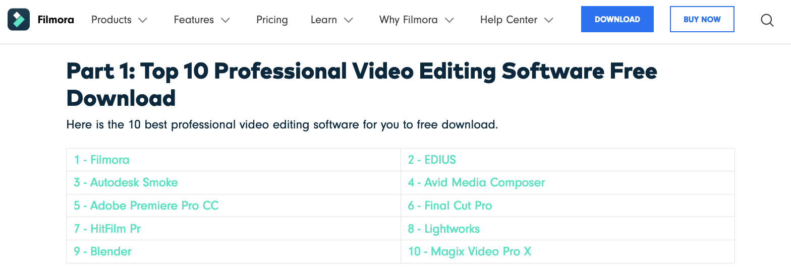

# seo-garbage 🚯
Searching the internet has become terrible. This blocklist aspires to make it a little less terrible by filtering out poor-quality SEO-optimised websites. 

## Usage
You can use this blocklist with a tool like [ublacklist](https://github.com/iorate/uBlacklist) to exclude certain websites from your search results.

## Contributing
Contributing is highly encouraged. If you find a website, feel free to open a pull request.

## Spotting a website
There are some common elements that emerge across SEO-optimised websites. These include:
- Information copied from other websites

- Biased information that promotes the companies own software above all others

- Sub-headings unrelated to the article's title

- Unrelated images

- Formatting errors

- Questions without answers

- Poor grammar

